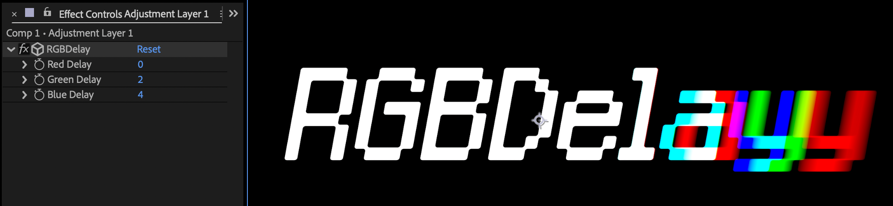

# RGBDelay

After Effects用のRGBチャンネルディレイエフェクトプラグイン

## 概要
RGBDelayは、After Effects用のRGBチャンネルディレイエフェクトプラグインです。各RGBチャンネルごとに独立したディレイ時間を設定でき、クリエイティブな映像効果を実現します。

## 主な変更点（v0.2.0）
- **Windows版を新たに追加**
- バグ修正・安定性向上

## 機能
- 各RGBチャンネルごとに独立したディレイ時間の設定（0-30フレーム）
- 8bit/16bit対応
- アルファチャンネルの適切な処理
- リアルタイムプレビュー

## 対応環境
- After Effects 2024 (v25.2)以降
- macOS 13以降
- Windows 10以降

## インストール方法

### macOS
1. [Releases](https://github.com/okmr0000/HotkeyLab/releases)から最新版をダウンロード
2. `bin/Mac/RGBDelay.plugin` を After Effects のプラグインフォルダに配置  
   `/Library/Application Support/Adobe/Common/Plug-ins/[バージョン]/MediaCore/`
3. After Effectsを再起動

### Windows
1. [Releases](https://github.com/okmr0000/HotkeyLab/releases)から最新版をダウンロード
2. `bin/Win/RGBDelay.aex` を After Effects のプラグインフォルダに配置  
   `C:\Program Files\Adobe\Common\Plug-ins\[バージョン]\MediaCore\`
3. After Effectsを再起動

## 使用方法
1. エフェクトパネルから「RGBDelay」を選択
2. 各チャンネルのディレイ時間を調整（0-30フレーム）

## 使用例
- グリッチ効果
- トランジション効果
- クリエイティブな映像表現

## 開発環境
- After Effects SDK 25.2
- Xcode 15
- Visual Studio 2022

## ライセンス
MIT License

## 作者・連絡先
Tsuyoshi Okumura/Hotkey ltd.
- X（旧Twitter）: [@okmura](https://x.com/okmura)

## 今後の予定
- パフォーマンスの最適化
- ユーザーフィードバックに基づく機能改善
- プリセット機能の追加
- より詳細なパラメータ制御

## フィードバック
バグ報告や機能要望は、[GitHub Issues](https://github.com/okmr0000/HotkeyLab/issues)までお願いします。 
