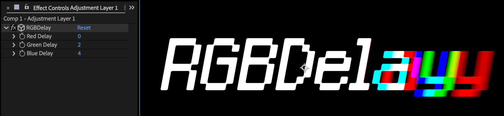

# RGBDelay

After Effects用のRGBチャンネルディレイエフェクトプラグイン

## 機能
- 各RGBチャンネルごとに独立したディレイ時間の設定
- 8bit/16bit対応
- アルファチャンネルの適切な処理

## 対応環境
- After Effects 2024 (v25.2)以降
- macOS 13以降

※ Windows版は現在開発中です

## インストール方法
1. `build/Mac`フォルダ内の`RGBDelay.plugin`をダウンロード
2. After Effectsのプラグインフォルダに配置
   - `/Library/Application Support/Adobe/Common/Plug-ins/[バージョン]/MediaCore/`

## 使用方法
1. エフェクトパネルから「RGBDelay」を選択
2. 各チャンネルのディレイ時間を調整（0-30フレーム）

## 開発環境
- After Effects SDK 25.2
- Xcode 15

## ライセンス
MIT License

## 作者
Tsuyoshi Okumura/Hotkey ltd.

## 今後の予定
- Windows版の開発
- パフォーマンスの最適化
- ユーザーフィードバックに基づく機能改善 